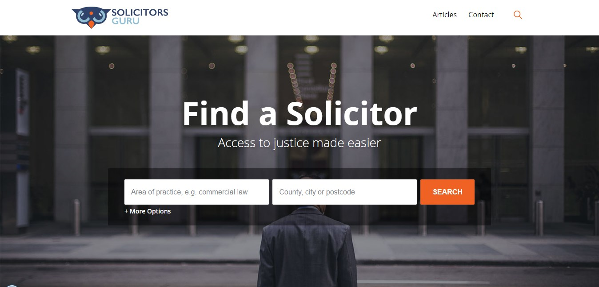
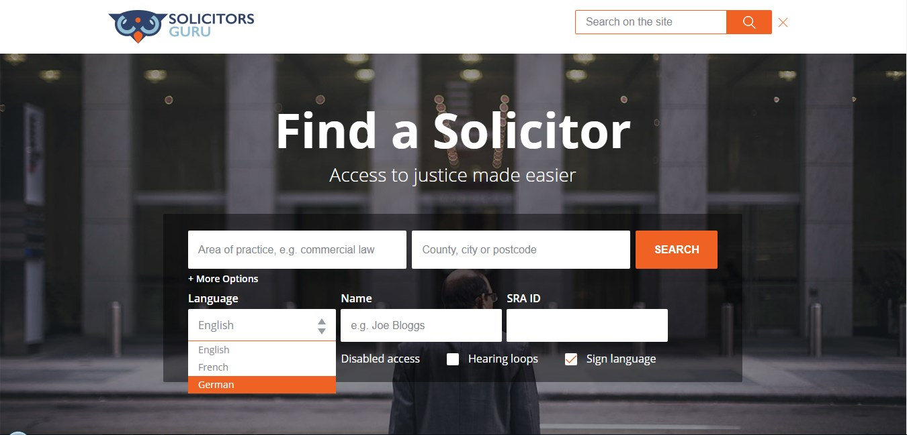
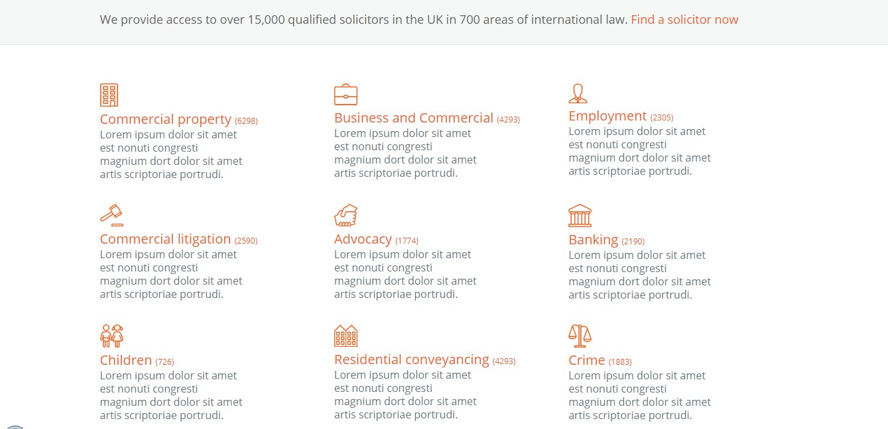
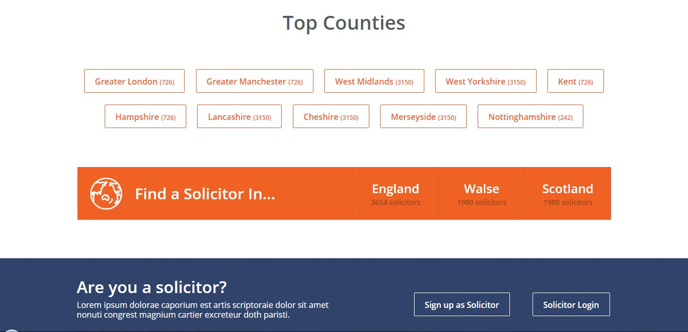
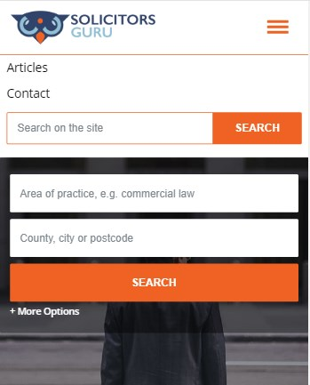
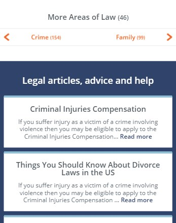
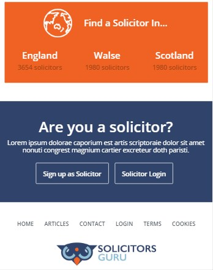

# Responsive Layout: Solicitors-Guru

Solicitors-Guru is a responsive layout. The layout is designed for the main page. This project includes HTML5, CSS3, jQuery and jQuery Form Styler, SlickNav, Slick plugins. It uses Gulp for compiling Sass to CSS, watching Sass files for changes, generating a sprite from images.

## Getting Started

* clone this GIT repository
* go to the folder `app` and run `index.html`

## Development

### Required preconditions

* [install](https://howtonode.org/how-to-install-nodejs) Node.js
* install Gulp
    ```
    $ npm install gulp -g
    ```
    
### Deployement steps

* clone this GIT repository
* go to the created folder
* install dependencies
    ```
    $ npm install
    ```

* run gulp
    ```
    $ gulp
    ```

* go to the folder `app` and run `index.html`

## Screenshots of the project







